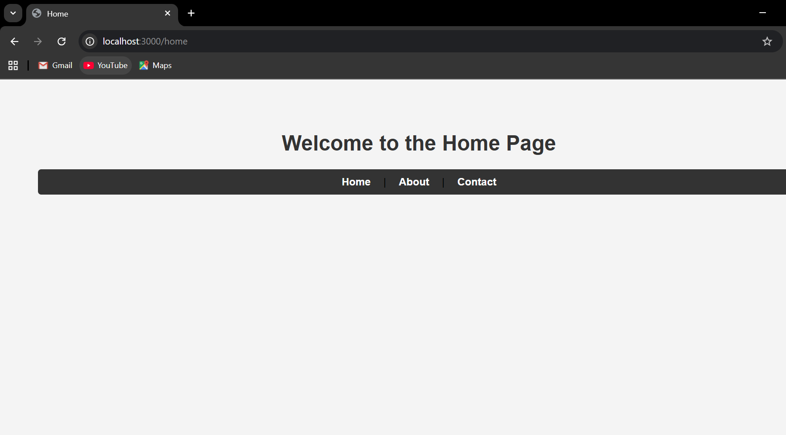
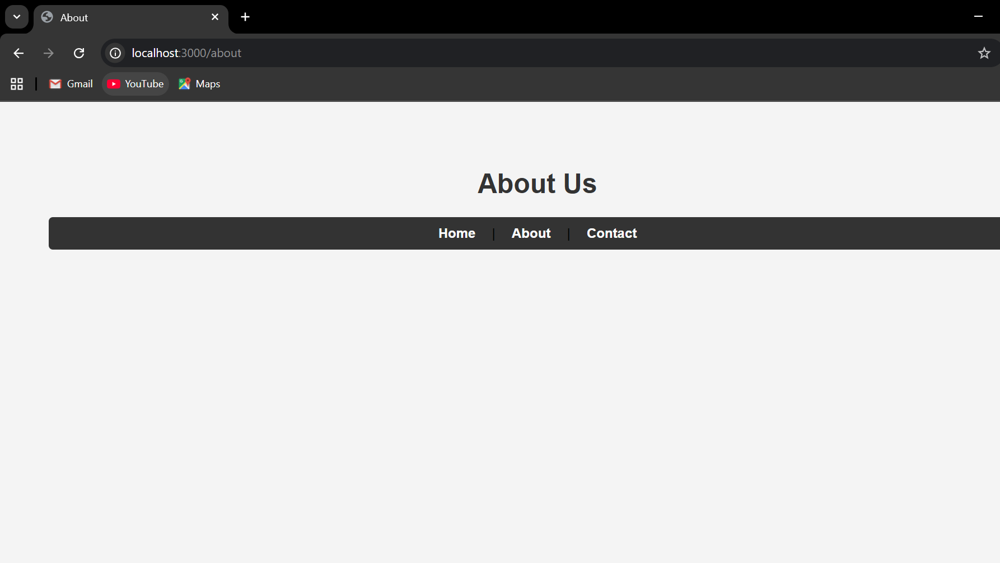
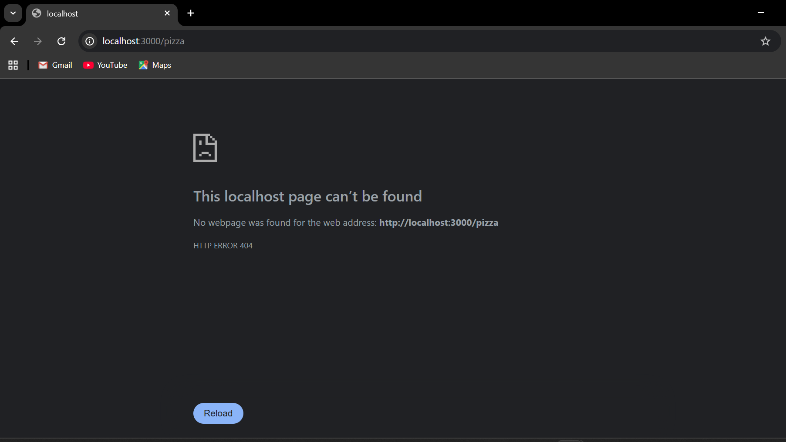

Project Overview
This project is a custom-built web server created as part of the MERN stack curriculum. The goal was to understand the fundamentals of back-end communication by serving static HTML content without the use of high-level frameworks like Express.

Key Features
Native Node.js Implementation: Built entirely with the built-in http module to handle server logic and requests.

Dynamic Routing: Implemented logic to serve specific HTML files based on the URL path (/home, /about, /contact).

Asynchronous File Serving: Leveraged the fs (File System) module to read and serve HTML documents asynchronously, ensuring the server doesn't block.

Custom 404 Handling: Includes a dedicated error handler that catches invalid URL requests and serves a custom 404 error page with the correct HTTP status code.

Modern UI: Every page features a consistent navigation bar and responsive CSS styling for a professional user experience.

### **Screenshots**

